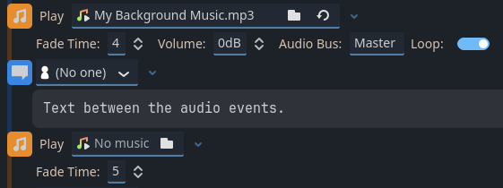

<div class="header-banner blurple">
     <div class="header-label blurple">Frequently Asked Questions</div>
</div>

## 📜 Content
[toc]

## May I use Dialogic in one of my projects?

Yes, you may use Dialogic to make any kind of game - even commercial ones!
The project is developed under the [MIT License](https://github.com/dialogic-godot/dialogic/blob/master/LICENSE). All we ask is that you please remember to credit us in your project!

If you want to be featured on the "Made with Dialogic"-page, get in touch with us on [Emilio's Discord server](https://discord.gg/2hHQzkf2pX)!

## How can I change the input?

Dialogic uses a Godot `InputAction` for the so-called "Input Action". By default, this is the `dialogic_default_action` which is automatically created when enabling the plugin. You can either edit this action or use a different input action by changing the setting in the dialogic settings Text section.

## How to make the dialog show up in the game?

The easiest way to make the dialog appear in your game is to call `Dialogic.start("res://path/to/timeline.dtl")` in your game. This will both create a [layout scene](styles-and-layouts.md) and start the timeline.

## Why are my portraits not showing up?

When using the Visual Novel layout, to make the characters show up on the screen, you need to make them join your current scene using the Character event (Join mode).

## Why isn't this part of Godot?

> The plugin is cool! Why is it not shipped with Godot?

I see numerous people saying that the plugin should come with Godot, but I believe this should stay as a plugin since most of the people making games won't be using it. I'm flattered by your comments, but this will remain a plugin :)

## How do I start and stop background music?

Use a `Music` event to set a resource and then cancel it with a `Music` event with no resource.



This example will fade in the music over 4 seconds and then fade it out over 5 seconds.

## How do I find the current speaker or its portrait index?

The following snippet will give you the current speaker and its portrait information, including the index.

```gdscript
var current_speaker: DialogicCharacter = Dialogic.Text.get_current_speaker()
var portrait_info := Dialogic.Portraits.get_character_info(current_speaker)
var speaker_portrait_index := portrait_info.position_index
```

## How can I find the name of the current timeline?

Timelines have no name, they are pure text.\
However, you can access the resource path:
```gdscript
var timeline_path := Dialogic.current_timeline.resource_path
```

## I change the timeline text, but the game shows old text?

If you have enabled translation, you will have to update the CSVs.\
Once your timeline events have translation IDs, matching CSV rows will take priority.\
Disabling the translation until you are done with most of the text is recommended.

## How do I hide and show the text-box?

The following code allows you to check if the text box is visible and then act based on its state.
```gdscript
if Dialogic.Text.is_textbox_visible():
    Dialogic.Text.hide_textbox()
else:
    Dialogic.Text.show_textbox()
```

## I encounter a small lag or freeze when starting the dialogue!

Preloading a style can be very useful using its `prepare` method.\
This can be called on all styles you will need during the splash screen of your game.

```gdscript
var style: DialogicStyle = load("res://path/to/my/style.tres")
style.prepare()
```

Last, be aware that Godot's shader compiler runs on demand; whenever new shaders need to be loaded in a style (or any resource), it will compile, causing a freeze.\
Hence, it's recommended to compile these ahead of time if you run into problems still.

## How to transition from dialog to gameplay?

When your dialog ends and you want to switch to a different context (e.g. gameplay) you will have to decide how to deal with the current dialog layout. In `Settings/General` you will find the `Layout Node Behaviour` setting, which you can switch between **Delete**, **Hide** and **Keep**. 

If you plan to have a transition that is managed outside of dialogic, you might have to use **Hide** and then manually show it again and hide it later. E.g.:

```gdscript
func _on_dialogic_timeline_ended() -> void:
    var layout := Dialogic.Styles.get_layout_node()
    layout.show()
    # do my transiton
    await transtion_finished
    layout.hide()
```

Or you trigger the transition from within the timeline, so that the timeline only ends once the transition asks for it. Then you can use the **Hide** or **Delete** modes. Here is an example scene transition code snippet (on an autoload), that is then called from the timeline:

```gdscript
func change_scene(scene_path: String):
    Transition.fade_out()
    await Transition.fade_out_completed
    get_tree().change_scene_to_file(scene_path)
```


