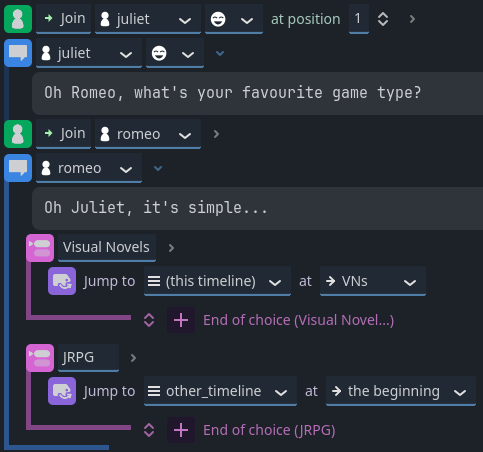

<div class="header-banner dawn">
     <div class="header-label dawn">Introduction to Dialogic 2</div>
</div>

```admonish Info
This documentation is for Dialogic 2.

Dialogic 2 is still in-development and marked as Alpha, there may be workflow breakage!
```

## What is Dialogic 2?

The Dialogic plugin allows you to easily create in-game dialogs or fully fledged **Visual Novels** with Godot.

Let's have an overview of what Dialogic 2 can do for you!

### 1. Timelines!

They control the flow of your story. They can be edited in a writer-friendly **Visual Editor** or your editor of choice.



If you prefer to write your timelines as pure text, you can do that too! Dialogic even has a powerful text editor with autocompletion and syntax highlighting. You can use any text editor though. Here is the same timeline in text format:

```dtl
join juliet 1
juliet: Oh Romeo, what's your favourite game type?
join romeo 2
romeo: Oh Juliet, it's simple...
- Visual Novels
    jump VNs
- JRPG
    jump other_timeline
```

No threads attached, you can mix and match as you please! 

### 2. Events

Each timeline contains events, and Dialogic equips you with many built-ones to get your story started today! And when you reach their limit, you can easily create more.


### 3. Customization by design

Cannot find the right Event? Need more options for your character portraits? You want to simplify how your designer can adjust the theme of your game?

It's all here and ready for you: Dialogic 2 is easy to use for writers and powerful but intuitive to extend for programmers.

[Create your own specific Events](creating-extensions.md) with very little code, and your designers can instantly use them as if they were part of Dialogic.

### 4. Character system and editor

An entire system to create and manage your characters, with a built-in editor inside Dialogic.
No need to program anything, just create your characters and use them in your timelines.

### There is more!

We are just scratching the surface of what's possible.\
Here is a small list of other things you can do:

- [Create events and timelines in code!](creating-timelines-in-code)

- Use built-in "text actions", for instance `[speed]`, `[pause]`, `[signal]`, `[portrait]`.

- [Easy-to-use variables in your timelines!](variables.md)

- Create a glossary for words and let your players hover them to discover the definition.

- [Translate characters and timelines](translation.md) with the integrated CSV file system!

- [Seamlessly create Custom Events](creating-extensions.md); they are all scripts! (`.gd`).

- Access functionality from code, for instance, `"Dialogic.Portraits.change_portrait(Emilio, "happy")`, `Dialogic.Backgrounds.update_background("res://icon.png")`

## How do I get started?

First, [let's get Dialogic up and running](getting-started)! After this step, the numerous pages on the left-side navigation bar will aid you with your dialog-driven game adventure!

Need more information? Try the search or open an issue on the GitHub repository!

---

## Can I upgrade from Dialogic 1 to Dialogic 2?

There are several problems to overcome when upgrading from Dialogic 1.

First, Dialogic 1 is exclusively for Godot 3, while Dialogic 2 requires for Godot 4.1 or higher.
Hence your project must work in Godot 4.1, it's a very different engine with a lot of changes.

If you have already made a lot of progress in your game, there is no reason to upgrade. We recommend you stick to Godot 3 and Dialogic 1.
However, if you want to give it a try, thanks to our contributors, there is a Dialogic 1 to Dialogic 2 converter available.
